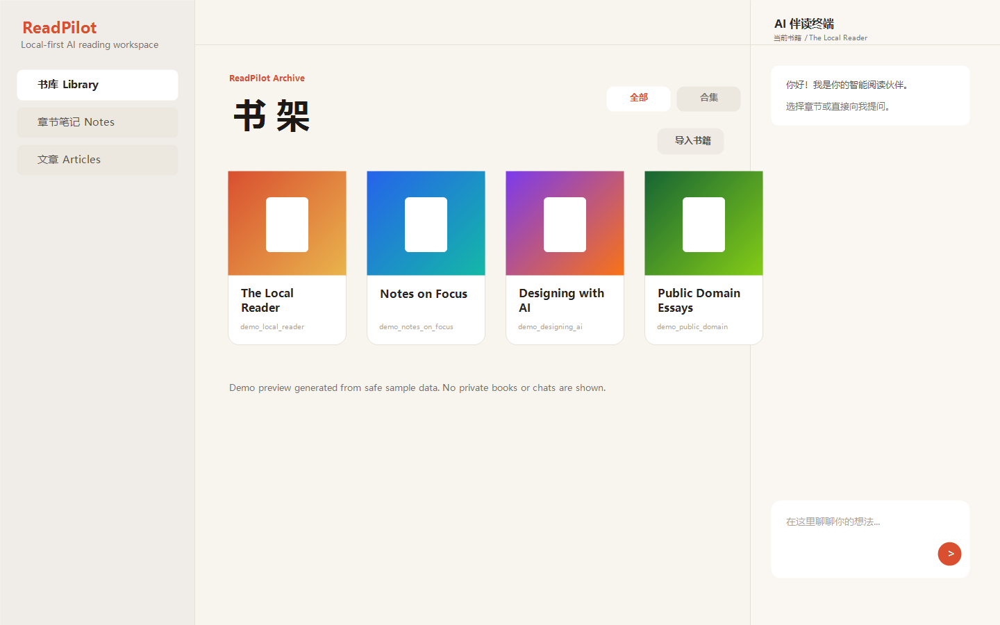
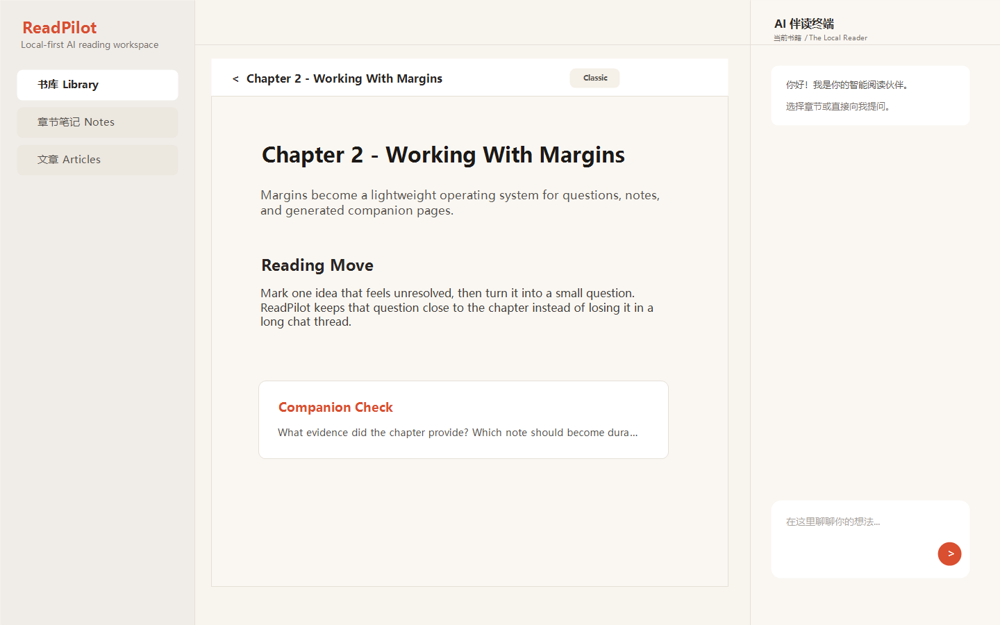

<div align="center">

# ReadPilot

**把 EPUB 变成一个本地优先的 AI 伴读工作台，用于深度阅读、笔记、追问和伴读页生成。**


[为什么做](#为什么做) · [能生成什么](#能生成什么) · [如何使用](#如何使用) · [Agent 支持](#agent-支持) · [快速开始](#快速开始) · [文档](#文档)

</div>

---



## 为什么做

读完一本好书之后，真正困难的通常不是“有没有摘要”，而是：

- 想回到某个概念时，只记得大概位置，找不到上下文。
- 问 AI 一本书的问题时，回答容易脱离原文或变成泛泛而谈。
- 读书笔记越写越长，最后变成一个很少再打开的文档。
- 一章里真正值得反复咀嚼的结构、问题和例子，没有沉淀成可复访的页面。

ReadPilot 的思路是：让书、笔记、对话和生成页面都围绕同一个本地阅读工作区展开。你读到哪里，AI 就围绕哪里帮你解释、追问、整理和生成。

## 能生成什么

ReadPilot 不是一次性把整本书做成课程，而是在阅读过程中按需生成材料：

- 章节伴读页：把当前章节拆成概念、论证链、关键问题和复习提示。
- 主题深挖页：围绕某个概念生成可复访的解释页面。
- 对比页：把两个概念、人物、模型或章节并排分析。
- 书籍 Hub：汇总进度、已生成页面、主题索引和下一步建议。
- Markdown 笔记：编辑和预览分开，适合记录理解、摘录、疑问和复习线索。

普通解释、摘要、检验题和追问默认停留在 ChatPanel。只有当你明确要求“生成页面”时，ReadPilot 才进入伴读页工作流。

## 如何使用

1. 导入一本 EPUB。
2. 在单本书 Hub 查看章节、进度和已生成内容。
3. 进入阅读页，按章节阅读。
4. 在右侧 ChatPanel 直接提问、整理、追问。
5. 用 Markdown 写笔记，并在需要时切换预览。
6. 对值得保留的主题生成伴读页，之后可在 Hub 中反复打开。



## Agent 支持

ReadPilot 当前支持 Claude Code，并已经加入 Codex provider adapter。ChatPanel 负责会话初始化、流式输出、工具调用展示、TODO/计划状态、错误恢复和宽度调整。

项目提供 `.codex/config.toml`，方便已配置 Codex 的用户在受信任项目中加载 ReadPilot 的本地上下文能力。普通用户不需要手动理解内部适配细节，只需要在应用中选择可用 provider。

## 微信读书增强

微信读书集成是可选能力。配置后，ReadPilot 可以绑定对应书目，同步划线、想法和阅读进度，并把这些读者侧记忆用于后续伴读对话。

## 快速开始

环境要求：

- Node.js 20+
- npm
- Python 3.10+
- Claude Code CLI 或已配置好的 Codex CLI

安装依赖：

```bash
npm install
pip install ebooklib beautifulsoup4
```

创建本地配置：

```bash
cp .env.example .env.local
```

启动应用：

```bash
npm run dev
```

打开：

```text
http://localhost:3000
```

## 项目结构

```text
ReadPilot/
  src/                 # Next.js 应用、API、UI、状态和本地逻辑
  scripts/             # EPUB 转换器和辅助脚本
  skills/              # 伴读 skill 入口
  docs/                # 安装、使用、结构说明和伴读页参考资料
  data/                # 本地运行数据目录
```

伴读页生成规范位于 [docs/references](docs/references)。可加载的 skill 入口位于 [skills](skills)。

## 文档

- [文档总览](docs/README.md)
- [安装与运行](docs/SETUP.md)
- [使用流程](docs/USAGE.md)
- [项目结构](docs/PROJECT_STRUCTURE.md)
- [依赖说明](docs/DEPENDENCIES.md)
- [贡献指南](CONTRIBUTING.md)

## 常用脚本

```bash
npm run dev
npm run build
npm run start
npm run lint
npm run test
```

## 许可

ReadPilot 使用 [MIT License](LICENSE) 发布。
