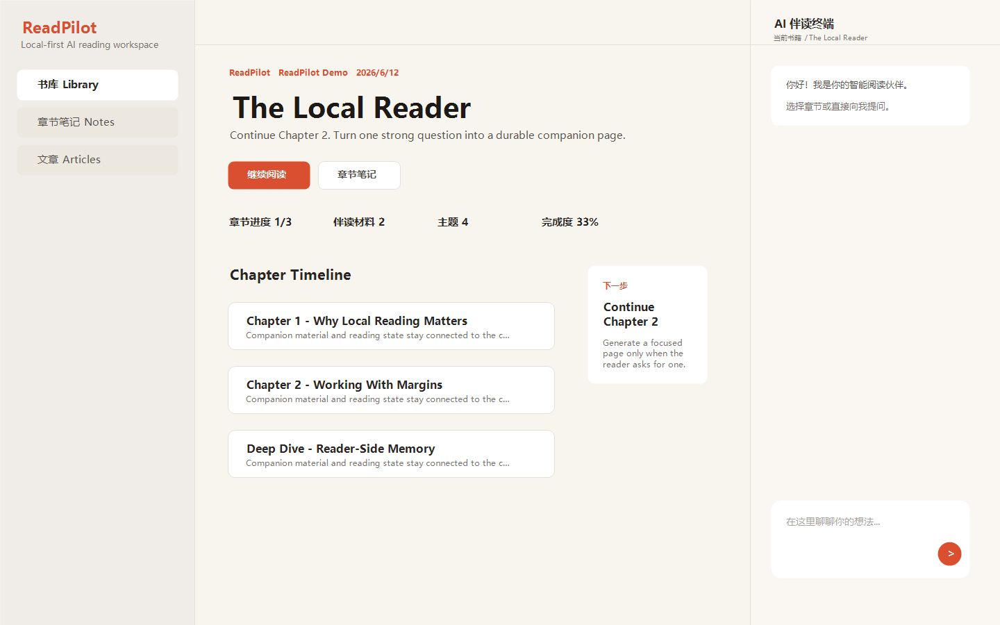

# ReadPilot

[English](README.md)

ReadPilot 是一个本地优先的 AI 伴读工作台：导入 EPUB，把书籍保存在本地书库中，在阅读页旁边直接与 Claude Code 对话，并按阅读进度生成可交互的伴读页面。

它不是“把一本书一次性总结完”的工具，而是面向认真阅读的人：读到哪里，理解、笔记、追问和伴读页就生长到哪里。

## 界面预览

以下图片使用安全演示数据生成，不包含私人书籍、笔记或聊天记录。





## 适合谁

- 想把长书读透，而不是只拿一份摘要的人
- 想在阅读过程中持续提问、做笔记、生成章节拆解页的人
- 想研究“AI + 阅读 + 本地知识工作台”产品形态的开发者
- 想把 Claude Code / Claude Agent SDK 接入真实桌面式工作流的人

## 核心能力

- 本地书库：导入 EPUB，按书籍维护 `progress.json`、原始章节、生成页和阅读状态
- 中央阅读工作台：保留 EPUB 排版、目录、章节时间线、Hub 和伴读页入口
- 右侧 Claude Chat：通过 `@anthropic-ai/claude-agent-sdk` 接入 Claude Code，支持流式输出、Markdown 渲染、工具读写提示和 token 使用反馈
- 伴读页生成：配套 `reading-companion` skill，把章节、主题或阶段总结生成独立 HTML 页面
- 微信读书增强：可绑定微信读书书目，同步划线、想法和阅读进度，并把这些“读者侧记忆”提供给伴读对话
- 笔记与进度：SQLite 保存对话和笔记，本地文件保存书籍内容与伴读产物
- 渐进式数据模型：普通问答留在 ChatPanel，只有明确要求“生成页面”时才进入伴读页工作流

## 用户旅程

1. 安装 Node.js、Python 和 Claude Code。
2. 本地启动 ReadPilot，进入书库。
3. 导入 EPUB。ReadPilot 会把书籍数据写入 `data/books/<book-slug>/`。
4. 在中间阅读区按章节阅读。
5. 在右侧 ChatPanel 进行普通问答。
6. 只有当你明确要求生成伴读页时，才把问题变成可复访的 HTML 页面。

完整说明见 [docs/USAGE.md](docs/USAGE.md)。

## 项目结构

```text
ReadPilot/
  src/                 # Next.js 应用、API、UI、状态、DB/文件/Claude 逻辑
  scripts/             # EPUB 转换器和辅助脚本
  skills/              # Claude Code skill 的唯一入口
  docs/                # 安装、使用、结构、参考资料、展示图
  data/                # 本地运行数据，除 data/.gitkeep 外不提交
```

导入书籍后会生成：

```text
data/books/<book-slug>/
  source.epub
  source.jsonl
  source-manifest.json
  progress.json
  companion/
  pages/
```

完整目录和隐私边界见 [docs/PROJECT_STRUCTURE.md](docs/PROJECT_STRUCTURE.md)。

## 技术栈

- Next.js 16 App Router
- React 19 + TypeScript
- Tailwind CSS v4 + Base UI / shadcn 风格组件
- Zustand 状态管理
- better-sqlite3 本地数据库
- Claude Agent SDK / Claude Code
- Python EPUB 转换脚本：`ebooklib`、`beautifulsoup4`

## 快速开始

环境要求：

- Node.js 20 或更高版本
- npm
- Python 3.10 或更高版本
- Claude Code CLI，并确保 `claude` 命令可用

安装依赖：

```bash
npm install
pip install ebooklib beautifulsoup4
```

准备本地配置：

```bash
cp .env.example .env.local
```

启动开发服务器：

```bash
npm run dev
```

然后打开 `http://localhost:3000`。

## Claude Code 配置

ReadPilot 默认通过本机 Claude Code / Claude Agent SDK 工作。请先在终端中确认：

```bash
claude --version
```

官方资源：

- Claude Code 文档：https://docs.anthropic.com/en/docs/claude-code/overview
- 安装与设置：https://docs.anthropic.com/en/docs/claude-code/setup
- Claude Code SDK：https://docs.anthropic.com/en/docs/claude-code/sdk
- Claude Agent SDK npm 包：https://www.npmjs.com/package/@anthropic-ai/claude-agent-sdk

常见安装方式：

```bash
npm install -g @anthropic-ai/claude-code
```

如果你的环境依赖 API Key，请按 Claude Code 或 Anthropic 官方方式配置，不要把密钥提交到仓库。Windows 环境下如果 Claude Code 需要 Git Bash，可在 `.env.local` 中设置 `CLAUDE_CODE_GIT_BASH_PATH`。

## 微信读书 Skill 配置

微信读书集成是可选能力。配置后，ReadPilot 可以把本地书和微信读书书目绑定起来，同步你的划线、想法、阅读进度和阅读统计。

1. 访问微信读书 Skill 控制台获取个人 API Key： https://i.weread.qq.com/skills/agent
2. 打开 ReadPilot 的 `/settings` 页面，填入 `wrk-` 开头的 key 并测试连接。
3. 回到书库，在书籍卡片上点击链接图标，搜索并绑定对应的微信读书书目。
4. 绑定后，章节笔记区会显示微信读书划线；ChatPanel 也会在当前书已绑定时获得这些读者侧上下文。

微信读书数据会缓存到本地 SQLite。请不要把 `data/readpilot.db*` 提交到公开仓库。

## 数据与隐私

ReadPilot 默认把运行数据放在 `data/`：

- `data/books/`：导入的书籍、EPUB 源文件、章节 JSONL、生成的 HTML 伴读页
- `data/readpilot.db`：本地聊天、笔记等 SQLite 数据
- `.env.local`：本地环境变量和可能的密钥

这些文件默认不应进入公开仓库。开源前请确认没有提交私人书籍、数据库、聊天记录、API Key 或带版权风险的生成页面。

## 常用脚本

```bash
npm run dev       # 本地开发
npm run build     # 生产构建
npm run start     # 启动生产构建
npm run lint      # ESLint
npm run test      # Vitest
```

## 配套 Skill

仓库中包含两个面向 Claude Code 的伴读 skill 模板：

- 英文版：[skills/reading-companion/SKILL.md](skills/reading-companion/SKILL.md)
- 中文版：[skills/reading-companion-zh/SKILL.md](skills/reading-companion-zh/SKILL.md)

它们的目标是把一本书变成“随阅读进度生长”的伴读系统，而不是一次性批量生成课程。普通解释、摘要、检测题和轻量问答应留在 ChatPanel，只有明确要求生成或更新页面时才进入伴读页工作流。

伴读页的设计、模板、数据结构和方法论参考放在 [docs/references](docs/references)。这些文件只是页面生成参考，不是 skill 入口；可发布、可复制给 Claude Code 使用的 skill 统一以 `skills/` 目录为准。

较完整的伴读页生成方法论见 [docs/references/companion-methodology.md](docs/references/companion-methodology.md)。它不是第二个 skill 入口，而是给 skill 和开发者参考的生成规范。

如果你准备展示示例，建议只使用自有文本或公版文本，避免公开版权书籍原文。

## 文档

- [安装与运行](docs/SETUP.md)
- [使用旅程](docs/USAGE.md)
- [项目目录说明](docs/PROJECT_STRUCTURE.md)
- [依赖说明](docs/DEPENDENCIES.md)
- [伴读页参考资料](docs/references)
- [贡献指南](CONTRIBUTING.md)
- [安全与隐私](SECURITY.md)
- [第三方声明](NOTICE.md)

## 开源协议

ReadPilot 使用 [MIT License](LICENSE)。
